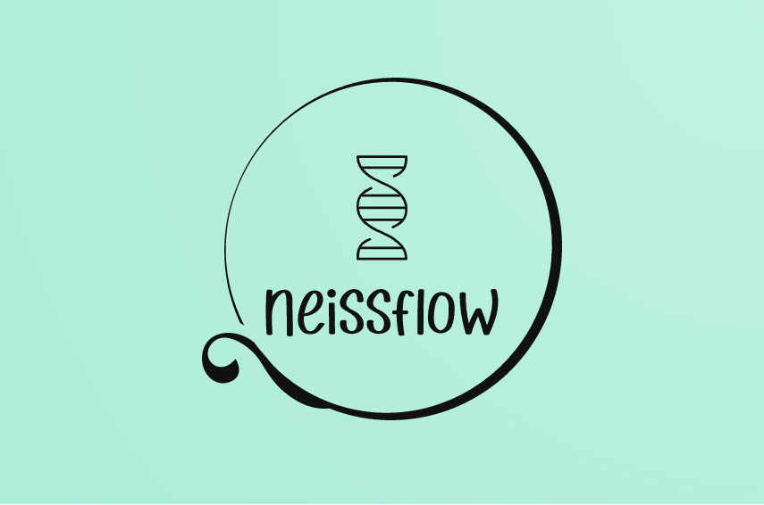
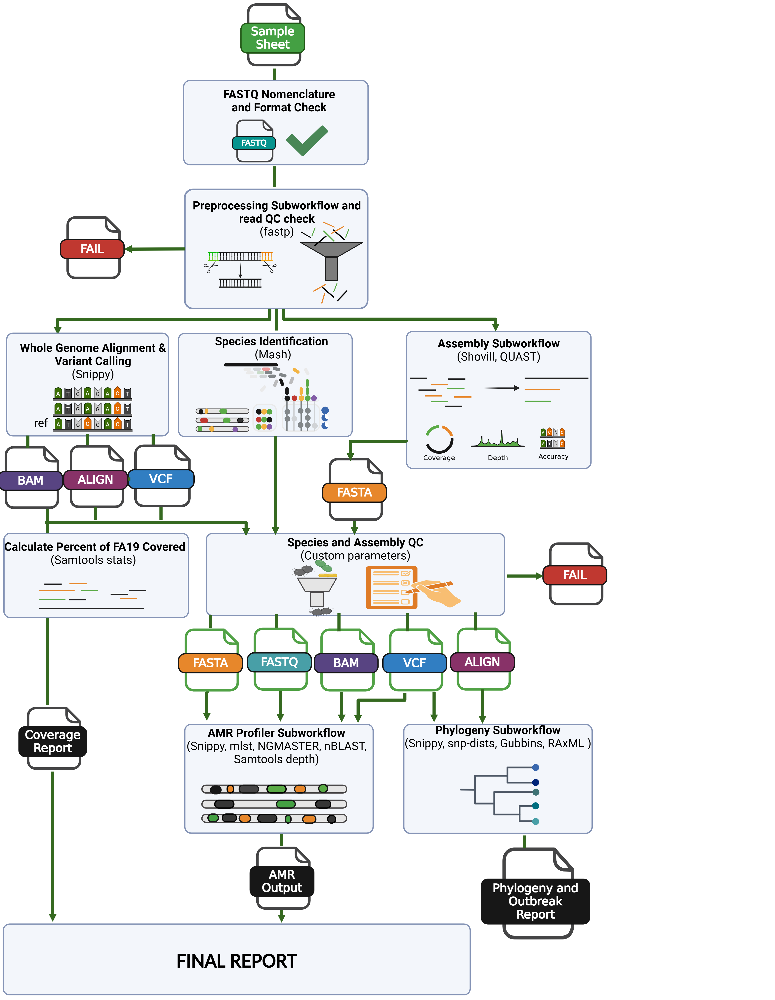
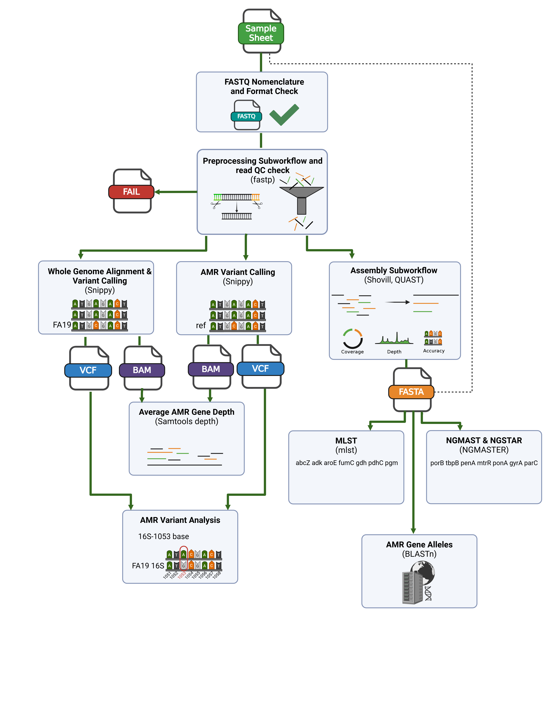
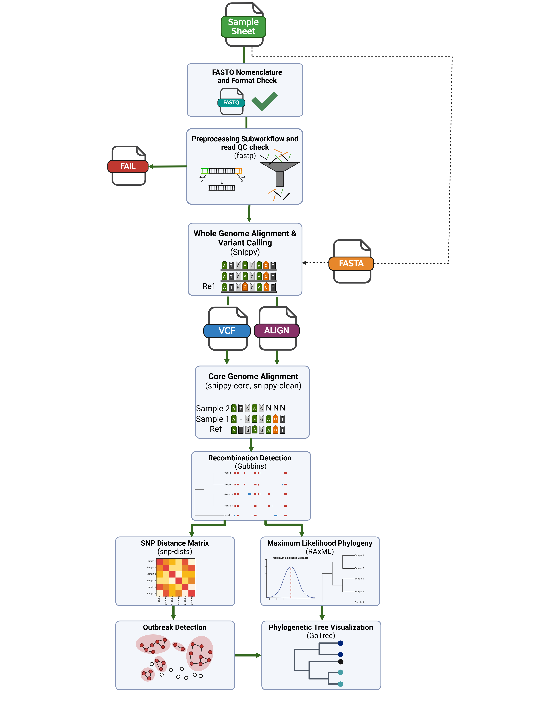

<center></center>  

---

[](https://www.nextflow.io/)
[](https://nf-co.re/)
[](https://sylabs.io/docs/)
[](https://github.com/CDCgov/neissflow/-/releases)

# neissflow
neissflow is a Nextflow pipeline for Neisseria gonorrhoeae (Ng) isolate analysis. The mission of neissflow is to consolidate commonly used bioinformatics tools for Ng analysis into a parallel and scalable pipeline. Having all your tools in one place allows you to rapidly generate data and respond quickly to public health demands!  
  
neissflow is currently undergoing validation in accordance with Next-Generation Sequencing (NGS) quality metrics and Quality Manual for Microbiological Laboratories (QMML) standards; users are advised to interpret the results with caution until official validation is complete.

<center></center>

## Software
Below is a list of the bioinformatics tools currently integrated into neissflow.

 1. [fastp](https://github.com/OpenGene/fastp) - a tool for all-in-one FASTQ processing, including quality filtering, adaptor-trimming, and quality-trimming, as well as quality profiling
 2. [Samtools stats](https://www.htslib.org/doc/samtools-stats.html) - a tool for collecting statistics from BAM files and outputting them in a text format 
 3. [Mash](https://mash.readthedocs.io/en/latest/) - a tool for species screening via fast genome and metagenome distance estimation using MinHash 
 4. [Shovill](https://github.com/tseemann/shovill) - an assembly tool for illumina paired end reads 
 5. [QUAST](https://github.com/ablab/quast) - a tool for evaluating assemblies through calculating and reporting quality metrics
 6. [Snippy](https://github.com/tseemann/snippy) - a tool for rapid haploid variant calling and core genome alignment
 7. [mlst](https://github.com/tseemann/mlst) - a tool for scanning contigs against PubMLST typing schemes.
 8. [NGMASTER](https://github.com/MDU-PHL/ngmaster) - a tool for performing multi-antigen sequence typing for Neisseria gonorrhoeae (NG-MAST) and Neisseria gonorrhoeae sequence typing for antimicrobial resistance (NG-STAR)
 9. [BLASTn](https://github.com/ncbi/blast_plus_docs) - basic local alignment search tool (BLAST) for comparing nucleotide sequences to those in a database.
 10. [Samtools depth](https://www.htslib.org/doc/samtools-depth.html) - a tool for calculating the read depth at a given position from an alignment.
 11. [snp-dists](https://github.com/tseemann/snp-dists) - a tool for generating a SNP distance matrix from a FASTA core alignment
 12. [Gubbins](https://github.com/nickjcroucher/gubbins) - a tool for marking recombination regions and constructing a phylogeny based on mutations outside of those regions
 13. [RAxML](https://cme.h-its.org/exelixis/resource/download/NewManual.pdf) - a tool for performing Maximum Likelihood based inference of large phylogenetic trees
 14. [Gotree](https://github.com/evolbioinfo/gotree) - tool to manipulate phylogenetic trees and generate visualizations
 15. [MultiQC](https://pubmed.ncbi.nlm.nih.gov/27312411/) - tool for summarizing analysis results for multiple tools and samples in a single report  

## Running neissflow from Nextflow Tower
neissflow has been tested on Nextflow Tower and will run as any other pipeline. This version of neissflow will need to be forked and modified, due to references being included within the repository. See [installation.md](./docs/installation.md) for further instructions

## Running neissflow from the terminal

1. **Example: run neissflow with test profile**  
    The test profile will run neissflow with a set of test samples, this can be used to check if neissflow is working correctly.
  
  - Log into your linux terminal 

  - Ensure you have followed the instructions in [installation.md](./docs/installation.md)

  - Execute neissflow as instructed below. (Using whatever profile is suited to your computing environment in place of all)

  ```
  $ nextflow run neissflow/main.nf -profile singularity,all,test --outdir <OUTDIR> --name <RUN NAME>
  ```
 
  In this example, just the test sample set will be run through neissflow, and it will procede through all of the steps. 

## Input Requirements

### FASTQ Nomenclature
To successfully run the pipeline, the FASTQ files need to be named appropriately, so that the pairs can be correctly identified. The acceptable file patterns can be found in the table below:  

  <center>  

  | Naming Pattern   | Example pairs |
  | -------- | ----------- |
  | \*_{R1,R2}\*.  | <table> <tbody>  <tr>  <td>CA028_S1_L001<b>_R1</b>_001.fastq.gz, CA028_S1_L001<b>_R2</b>_001.fastq.gz </td>   </tr>  <tr>  <td>Test<b>_R1.</b>fastq.gz, Test<b>_R2.</b>fastq.gz </td>  </tbody>  </table>  | 
  | *_{1,2}. | CAJNED01<b>_1.</b>fastq.gz, CAJNED01<b>_2.</b>fastq.gz  |
  | *_{01,02}. | Test<b>_01.</b>fastq.gz, Test<b>_02.</b>fastq.gz | 

  </center>

### FASTQ Extensions
To successfully run the pipeline all FASTQ files must be gunzipped. Below is a list of acceptable file extensions.  

 <center>  

  | Extensions |
  | -------- |
  | .fastq.gz |
  | .fq.gz  | 

 </center> 

 ### FASTQ format
 Additionally, all FASTQ file content needs to follow accepted formatting for FASTQ files, this does not need to be checked ahead of time. However, if the pipeline does 	not run and the above conditions are met, this is the likely culprit. A descriptive error message can be found in the run log files if this is the case.

 ### FASTA Extensions
 Below is a list of acceptable file extensions for input FASTA assemblies.  
 <center>  

  | Extensions |
  | -------- |
  | .fasta |
  | .fa  | 

 </center> 

 If you choose to use contigs that have already been generated for the samples you are running through neissflow ensure that these have already passed through quality control steps as neissflow does not QC pre assembled contigs.

## Options
The majority of the neissflow components can be run a la carte depending on your analysis needs. Depending on which portions of the pipeline you would like to run, or skip, there is also the option to run with just FASTQ input, just FASTA contig input, or both. For more information on running neissflow, checkout [`docs/usage.md`](docs/usage.md). 


**Typical pipeline command:**

  `nextflow run neissflow/main.nf -profile singularity,all --input samplesheet.csv --outdir <OUTDIR> --name <RUN NAME> --only_fastq`

**Input/output options**  

  `--input`&nbsp;&nbsp;&nbsp;&nbsp;&nbsp;&nbsp;&nbsp;&nbsp;&nbsp;&nbsp;&nbsp;&nbsp;&nbsp;&nbsp;&nbsp;&nbsp;&nbsp;&nbsp;&nbsp;&nbsp;&nbsp;&nbsp;&nbsp;&nbsp;&nbsp;&nbsp;&nbsp;&nbsp;&nbsp;Path to comma-separated file containing information about the samples in the experiment. [string]   
  `--outdir`&nbsp;&nbsp;&nbsp;&nbsp;&nbsp;&nbsp;&nbsp;&nbsp;&nbsp;&nbsp;&nbsp;&nbsp;&nbsp;&nbsp;&nbsp;&nbsp;&nbsp;&nbsp;&nbsp;&nbsp;&nbsp;&nbsp;&nbsp;&nbsp;&nbsp;&nbsp;&nbsp;The output directory where the results will be saved. You have to use absolute paths to storage on Cloud infrastructure. [string]  
   `--name`&nbsp;&nbsp;&nbsp;&nbsp;&nbsp;&nbsp;&nbsp;&nbsp;&nbsp;&nbsp;&nbsp;&nbsp;&nbsp;&nbsp;&nbsp;&nbsp;&nbsp;&nbsp;&nbsp;&nbsp;&nbsp;&nbsp;&nbsp;&nbsp;&nbsp;&nbsp;&nbsp;&nbsp;&nbsp;&nbsp;&nbsp;The The name of the run, this will be in the final report filename. [default: complete] [string]

**Input Type (required)**  
  `--only_fastq`&nbsp;&nbsp;&nbsp;&nbsp;&nbsp;&nbsp;&nbsp;&nbsp;&nbsp;&nbsp;&nbsp;&nbsp;&nbsp;&nbsp;&nbsp;&nbsp;&nbsp;&nbsp;&nbsp;Use flag if only FASTQ input is provided (entire pipeline can run with just FASTQ input) [boolean]  
  `--only_fasta`&nbsp;&nbsp;&nbsp;&nbsp;&nbsp;&nbsp;&nbsp;&nbsp;&nbsp;&nbsp;&nbsp;&nbsp;&nbsp;&nbsp;&nbsp;&nbsp;&nbsp;&nbsp;&nbsp;Use flag if only FASTA contigs are provided (only snippy and the Phylogeny Subworkflow will run with this input) [boolean]  
  `--fastq_w_fasta`&nbsp;&nbsp;&nbsp;&nbsp;&nbsp;&nbsp;&nbsp;&nbsp;&nbsp;&nbsp;&nbsp;&nbsp;&nbsp;Use flag if FASTQ and FASTA input are provided (entire pipeline can run with this input) [boolean] 

**Skip steps**  
  `--skip_fastq_check`&nbsp;&nbsp;&nbsp;&nbsp;&nbsp;&nbsp; Skip FASTQ format check (only skip if your FASTQs have already been QCed) [boolean]  
  `--skip_preprocess`&nbsp;&nbsp;&nbsp;&nbsp;&nbsp;&nbsp;&nbsp;&nbsp;&nbsp;Skip Preprocessing Subworkflow (only do this if your reads have already been preprocessed and QCed) [boolean]  
  `--skip_species_id`&nbsp;&nbsp;&nbsp;&nbsp;&nbsp;&nbsp;&nbsp;&nbsp;&nbsp;Skip Species_ID Subworkflow (will skip Mash and FA19 coverage steps used to determine if a sample is NG) [boolean]  
  `--skip_assembly`&nbsp;&nbsp;&nbsp;&nbsp;&nbsp;&nbsp;&nbsp;&nbsp;&nbsp;&nbsp;&nbsp;&nbsp;&nbsp;Skip Assembly Subworkflow (if you do this and do not provide assemblies, the AMR_Profiler Subworkflow will not run) [boolean]  
  `--skip_assembly_qc`&nbsp;&nbsp;&nbsp;&nbsp;&nbsp;&nbsp;&nbsp;Skip Denovo Assembly QC script (do this if you are inputting non-shovill assemblies) [boolean]  
  `--skip_amr`&nbsp;&nbsp;&nbsp;&nbsp;&nbsp;&nbsp;&nbsp;&nbsp;&nbsp;&nbsp;&nbsp;&nbsp;&nbsp;&nbsp;&nbsp;&nbsp;&nbsp;&nbsp;&nbsp;&nbsp;&nbsp;&nbsp;&nbsp;Skip AMR_Profiler Subworkflow [boolean]   
  `--skip_phylogeny`&nbsp;&nbsp;&nbsp;&nbsp;&nbsp;&nbsp;&nbsp;&nbsp;&nbsp;&nbsp;&nbsp;Skip Phylogeny Subworkflow [boolean]

**Assembly Parameters**  
  `--downsample`&nbsp;&nbsp;&nbsp;&nbsp;&nbsp;&nbsp;&nbsp;&nbsp;&nbsp;&nbsp;&nbsp;&nbsp;&nbsp;&nbsp;&nbsp;&nbsp;&nbsp;&nbsp;&nbsp;Downsample reads to depth specified by depth parameter with shovill for assembly [boolean]  
  `--depth`&nbsp;&nbsp;&nbsp;&nbsp;&nbsp;&nbsp;&nbsp;&nbsp;&nbsp;&nbsp;&nbsp;&nbsp;&nbsp;&nbsp;&nbsp;&nbsp;&nbsp;&nbsp;&nbsp;&nbsp;&nbsp;&nbsp;&nbsp;&nbsp;&nbsp;&nbsp;&nbsp;&nbsp;&nbsp;Depth for downsampling reads for assembly with shovill [default: 150] [integer]

**Phylogeny Parameters**  
  `--reference_genome`&nbsp;&nbsp;&nbsp;&nbsp;&nbsp;&nbsp;&nbsp;Path to alternate reference genome [string]    
  `--remove_ref`&nbsp;&nbsp;&nbsp;&nbsp;&nbsp;&nbsp;&nbsp;&nbsp;&nbsp;&nbsp;&nbsp;&nbsp;&nbsp;&nbsp;&nbsp;&nbsp;&nbsp;&nbsp;&nbsp;&nbsp;Remove reference from the core alignment produced by the Phylogeny Subworkflow (reference will not appear in generated tree) [boolean]   
  `--snp_dist`&nbsp;&nbsp;&nbsp;&nbsp;&nbsp;&nbsp;&nbsp;&nbsp;&nbsp;&nbsp;&nbsp;&nbsp;&nbsp;&nbsp;&nbsp;&nbsp;&nbsp;&nbsp;&nbsp;&nbsp;&nbsp;&nbsp;&nbsp;&nbsp;SNP distance cutoff for direct connections used in outbreak detection algorithm [default: 20] [integer]  
  `--max_itr`&nbsp;&nbsp;&nbsp;&nbsp;&nbsp;&nbsp;&nbsp;&nbsp;&nbsp;&nbsp;&nbsp;&nbsp;&nbsp;&nbsp;&nbsp;&nbsp;&nbsp;&nbsp;&nbsp;&nbsp;&nbsp;&nbsp;&nbsp;&nbsp;&nbsp;&nbsp;Maximum number of iterations for Gubbins [default: 25] [integer] 
 
## QC Failure Conditions
There are two quality control (QC) checks performed in this pipeline, the first being a sequence check and the second being a species and assembly check.   

The conditions in the following table are used to pass/fail isolates after they are processed by fastp, such that only high quality FASTQ files are passed for further analysis:

 <center>  

  | Sequence QC Failure Conditions |
  | -------- |
  | Total reads before quality trimming & filtering < 352000  | 
  | Total reads after quality trimming and filtering < 88000  |
  | Total bases after quality trimming & filtering < 22418200 | 

 </center>  

 The conditions in the following table are used to pass/fail isolates based on their Mash identified species, mapping to the FA19 reference, and De novo assembly quality metrics, such that only high-quality Neisseria gonorrhoeae isolates are passed for further analysis: 

  <center>  

  | Species and Assembly QC Failure Conditions |
  | -------- |
  | Mash top hit is not Neisseria gonorrhoeae AND the percent of FA19 with greater than 10x coverage < 85% | 
  | The percent of FA19 with greater than 10x coverage < 85% |
  | Bases in contigs > 2500000 |
  | Mean coverage < 11 |
  | Bases in large contigs (>10000bp) < 1850000 AND Bases in contigs < 2100000 |
  | Mean coverage < 15 AND Fraction of contigs that are large contigs < 0.25 | 
  | Fraction of contigs that are large contigs (>10000bp) < 0.1 |

 </center>  

## Major Subworkflow Architectures
### AMR Profiler   
The AMR Profiler Subworkflow performs AMR typing on the samples with reference to sensitive NG reference, FA19, as well as identifying the presence of resistance genes, performing allele calls, and sequence typing with various sequence typing schemes (MLST, NGSTAR, NGMAST).  
The following diagram illustrates what the workflow would look like when running the AMR Profiler (along with its necessary preprocessing steps upstream in neissflow). 
<center></center>  

### Phylogeny
The Phylogeny Subworkflow performs core genome alignment, recombination detection, outbreak detection, and phylogenetic analysis on the samples in the set.  
The following diagram illustrates what the workflow would look like when running the Phylogeny steps (along with the necessary preprocessing steps upstream in neissflow).
<center></center> 

## Output
For a detailed summary of the neissflow output, checkout [`docs/output.md`](docs/output.md)

## Support
Post an issue on our issue tracker for any needed clarification, bugs, or proposed enhancements.

## Roadmap
Features that are currently being updated or will be added in the future include:

- Giving the option to run stringMLST or mlst 
- Producing a better annotated phylogenetic tree visualization
- Adding more positions of interest to the AMR Profiler variant analysis step based on recent findings

A recent abstract can be found [here](docs/neissflow_Abstract_APHL_2025.pdf)

## Authors and Acknowledgment
### Authors / Contributors
- Kat Morin
- Ethan Hetrick
- Apurva Shrivastava
- Eric Tran
- Matthew Schmerer
- [Sandeep Joseph](https://github.com/sandeepjosejoseph)

### Special thanks to
- Jack Cartee
- Brandi Celia-Sanchez
- Sam Chill
- Arvon Clemons
- Kim Gernert
- Katie Hebrank
- Ellen Kersh
- Amanda Smith

## Public Domain Standard Notice
This repository constitutes a work of the United States Government and is not
subject to domestic copyright protection under 17 USC § 105. This repository is in
the public domain within the United States, and copyright and related rights in
the work worldwide are waived through the [CC0 1.0 Universal public domain dedication](https://creativecommons.org/publicdomain/zero/1.0/).
All contributions to this repository will be released under the CC0 dedication. By
submitting a pull request you are agreeing to comply with this waiver of
copyright interest.

## License Standard Notice
The repository utilizes code licensed under the terms of the Apache Software
License and therefore is licensed under ASL v2 or later.

This source code in this repository is free: you can redistribute it and/or modify it under
the terms of the Apache Software License version 2, or (at your option) any
later version.

This source code in this repository is distributed in the hope that it will be useful, but WITHOUT ANY
WARRANTY; without even the implied warranty of MERCHANTABILITY or FITNESS FOR A
PARTICULAR PURPOSE. See the Apache Software License for more details.

You should have received a copy of the Apache Software License along with this
program. If not, see http://www.apache.org/licenses/LICENSE-2.0.html

The source code forked from other open source projects will inherit its license.

## Privacy Standard Notice
This repository contains only non-sensitive, publicly available data and
information. All material and community participation is covered by the
[Disclaimer](DISCLAIMER.md)
and [Code of Conduct](code-of-conduct.md).
For more information about CDC's privacy policy, please visit [http://www.cdc.gov/other/privacy.html](https://www.cdc.gov/other/privacy.html).

## Contributing Standard Notice
Anyone is encouraged to contribute to the repository by [forking](https://help.github.com/articles/fork-a-repo)
and submitting a pull request. (If you are new to GitHub, you might start with a
[basic tutorial](https://help.github.com/articles/set-up-git).) By contributing
to this project, you grant a world-wide, royalty-free, perpetual, irrevocable,
non-exclusive, transferable license to all users under the terms of the
[Apache Software License v2](http://www.apache.org/licenses/LICENSE-2.0.html) or
later.

All comments, messages, pull requests, and other submissions received through
CDC including this GitHub page may be subject to applicable federal law, including but not limited to the Federal Records Act, and may be archived. Learn more at [http://www.cdc.gov/other/privacy.html](http://www.cdc.gov/other/privacy.html).

## Records Management Standard Notice
This repository is not a source of government records, but is a copy to increase
collaboration and collaborative potential. All government records will be
published through the [CDC web site](http://www.cdc.gov).

## Additional Standard Notices
Please refer to [CDC's Template Repository](https://github.com/CDCgov/template) for more information about [contributing to this repository](https://github.com/CDCgov/template/blob/main/CONTRIBUTING.md), [public domain notices and disclaimers](https://github.com/CDCgov/template/blob/main/DISCLAIMER.md), and [code of conduct](https://github.com/CDCgov/template/blob/main/code-of-conduct.md).
